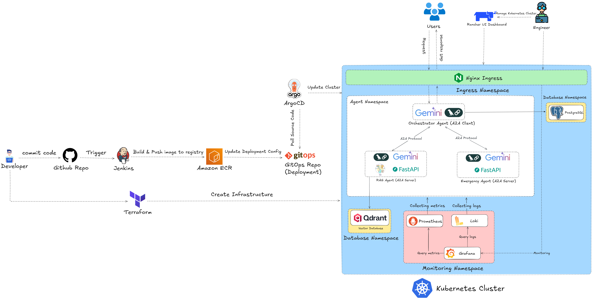

# LLMOps - Multi Agents - A2A 

## 1. Tổng quan về hệ thống

### 1.1. Kiến trúc tổng quan của hệ thống

### 1.2. Các công nghệ sử dụng
#### Cloud, Automation và Microservice
| Thành phần | Công nghệ |
|-----------|-----------|
| **Source code** | GitHub |
| **CI/CD** | Jenkins |
| **API** | FastAPI |
| **Containerize** | Docker |
| **Container Orchestration** | Kubernetes (K8s) |
| **K8s Package Manager** | Helm |
| **Vector embedding database** | Qdrant |
| **Ingress Controller** | Nginx |
| **Monitoring** | Prometheus, Grafana, Loki |
| **IaC** | Terraform |
| **Cloud Platform** | AWS or GCP |
#### LLM và Embedding Model
- **LLM Model**: Gemini API
- **Embedding Model**: [BAAI/bge-m3](https://huggingface.co/BAAI/bge-m3)
