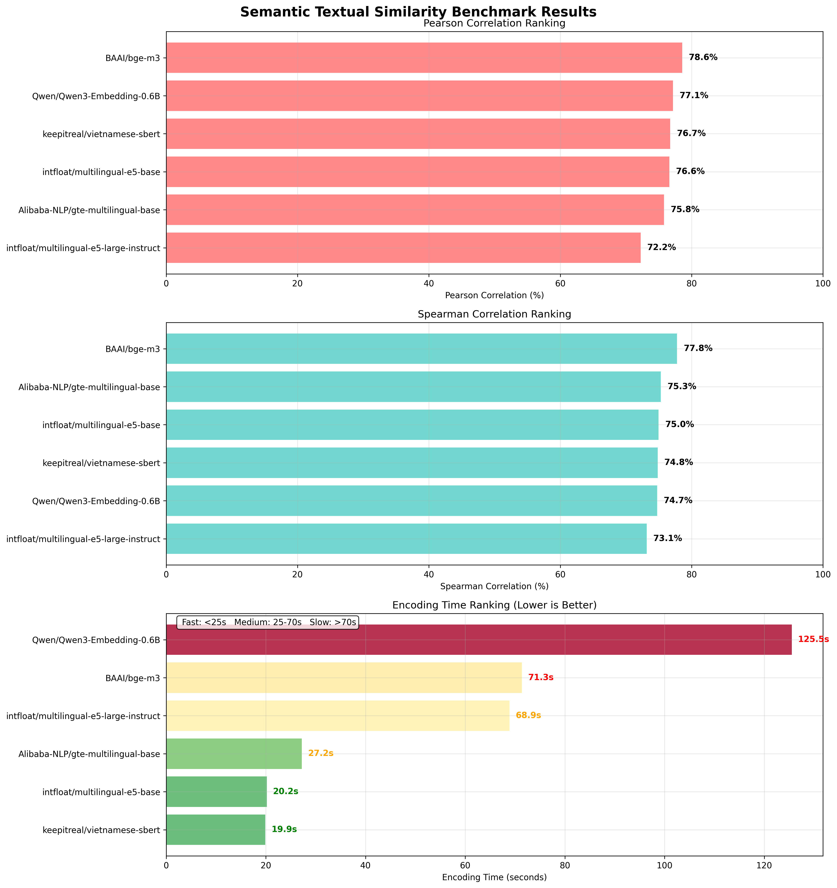
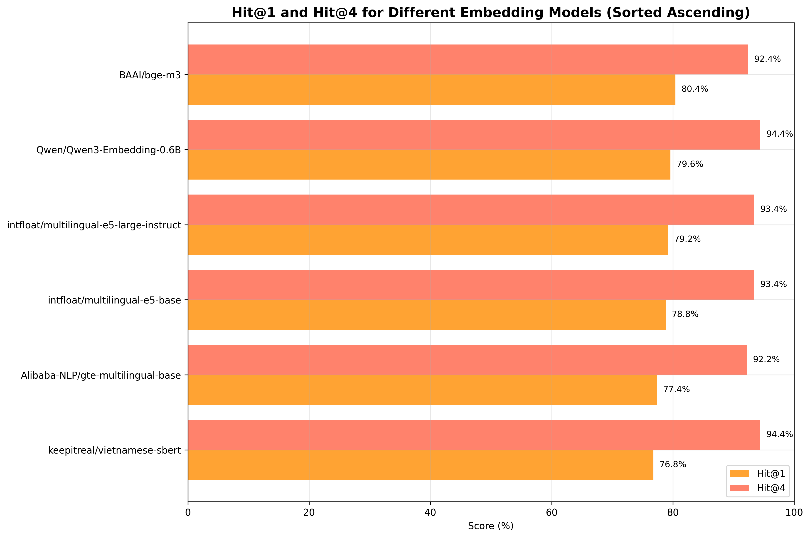

# Bộ Công Cụ Đánh Giá Mô Hình Embedding

Bộ công cụ đánh giá toàn diện cho việc đánh giá các mô hình embedding trên các tác vụ tiếng Việt và đa ngôn ngữ sử dụng các bộ dữ liệu và chỉ số chuẩn.

## 📊 Tổng Quan

Bộ công cụ đánh giá này cung cấp hai phương pháp đánh giá bổ sung cho nhau:

1. **Hit@K Benchmark** - Đánh giá dựa trên truy xuất, đo lường khả năng tìm kiếm tài liệu liên quan của mô hình
2. **STS Correlation Benchmark** - Đánh giá độ tương đồng ngữ nghĩa sử dụng tương quan với đánh giá của con người




## 🎯 Các Benchmark

### 1. Hit@K Benchmark (`hit_at_k_benchmark.py`)

**Mục đích**: Đánh giá hiệu suất truy xuất bằng cách đo lường tần suất câu trả lời đúng xuất hiện trong top-K kết quả được truy xuất.

**Bộ dữ liệu**: [ViSTS (Vietnamese Semantic Textual Similarity)](https://huggingface.co/datasets/anti-ai/ViSTS)
- 7 tập con: STS-B, STS12, STS13, STS14, STS15, STS16, STS-Sickr
- 500 cặp query-candidate cho mỗi lần test mô hình

**Chỉ số**:
- **Hit@1**: Phần trăm câu hỏi có câu trả lời đúng ở vị trí thứ 1
- **Hit@4**: Phần trăm câu hỏi có câu trả lời đúng trong top 4
- **Hit@10**: Phần trăm câu hỏi có câu trả lời đúng trong top 10

**Phương pháp**:
1. Tải các cặp câu từ bộ dữ liệu ViSTS
2. Sử dụng sentence1 làm queries, sentence2 làm candidates
3. Mã hóa tất cả câu bằng mô hình embedding
4. Tính độ tương đồng cosine giữa queries và candidates
5. Xếp hạng candidates theo độ tương đồng và kiểm tra xem kết quả đúng có trong top-K không

### 2. STS Correlation Benchmark (`sts_correlation_benchmark.py`)

**Mục đích**: Đánh giá mức độ tương quan giữa độ tương đồng của mô hình với đánh giá độ tương đồng của con người.

**Bộ dữ liệu**: [ViSTS (Vietnamese Semantic Textual Similarity)](https://huggingface.co/datasets/anti-ai/ViSTS)
- Cùng 7 tập con như Hit@K benchmark
- 1000 cặp câu cho mỗi lần test mô hình
- Điểm tương đồng của con người (chuẩn hóa 0-1)

**Chỉ số**:
- **Pearson Correlation**: Tương quan tuyến tính giữa độ tương đồng của mô hình và điểm số của con người
- **Spearman Correlation**: Tương quan thứ hạng giữa độ tương đồng của mô hình và điểm số của con người

**Phương pháp**:
1. Tải các cặp câu với điểm tương đồng của con người
2. Mã hóa cả hai câu bằng mô hình embedding
3. Tính độ tương đồng cosine giữa các sentence embeddings
4. Tính tương quan Pearson và Spearman với điểm số của con người

## 🤖 Các Mô Hình Được Kiểm Tra

| Mô Hình | Mô Tả | Số Chiều |
|---------|-------|----------|
| `intfloat/multilingual-e5-base` | Hiệu suất đa ngôn ngữ cân bằng | 768 |
| `Alibaba-NLP/gte-multilingual-base` | Mô hình đa ngôn ngữ tiên tiến | 768 |
| `keepitreal/vietnamese-sbert` | Mô hình SBERT chuyên biệt cho tiếng Việt | 768 |
| `Qwen/Qwen3-Embedding-0.6B` | Mô hình embedding Qwen lớn | 1024 |
| `BAAI/bge-m3` | Mô hình BGE đa ngôn ngữ | 1024 |
| `intfloat/multilingual-e5-large-instruct` | Mô hình E5 lớn được tinh chỉnh theo hướng dẫn | 1024 |

## 🚀 Cách Sử Dụng

### Bắt Đầu Nhanh
Cài đặt uv và dependencies
```bash
# Cài đặt uv
pip install uv

# Cài đặt dependencies
uv pip sync pyproject.toml
```

Chạy các benchmark riêng lẻ:

```bash
# Hit@K Benchmark
uv run hit_at_k_benchmark.py

# STS Correlation Benchmark  
uv run sts_correlation_benchmark.py
```

### Cấu Hình

Chỉnh sửa `config.py` để tùy chỉnh:

```python
# Kích thước mẫu để test nhanh hơn
HIT_AT_K_VALUES = [1, 4, 10]
RETRIEVAL_SAMPLE_SIZE = 500
STS_SAMPLE_SIZE = 1000

# Các tập con của dataset
VISTS_DATASETS = ['STS-B', 'STS12', 'STS13', 'STS14', 'STS15', 'STS16', 'STS-Sickr']
```

### Kiểm Tra Mô Hình Tùy Chỉnh

Thêm mô hình của bạn vào `config.py`:

```python
HIT_AT_K_MODELS = {
    "tên-mô-hình-của-bạn": {
        "name": "Tên Hiển Thị Mô Hình Của Bạn"
    },
    # ... các mô hình hiện có
}
```

## 📈 Các File Kết Quả

Mỗi benchmark tạo ra:

### Hit@K Benchmark
- `hit_at_k_benchmark_results.json` - Kết quả chi tiết với thông tin thời gian
- `hit_at_k_benchmark_summary.csv` - Bảng tóm tắt với các chỉ số chính
- `hit_at_k_benchmark_chart.png` - Biểu đồ kết hợp:
  - **Performance Chart**: So sánh Hit@1 và Hit@4
  - **Timing Chart**: Thời gian xử lý với color-coding (🟢 Fast <15s, 🟡 Medium 15-40s, 🔴 Slow >40s)

### STS Correlation Benchmark
- `sts_correlation_benchmark_results.json` - Kết quả tương quan chi tiết
- `sts_correlation_benchmark_summary.csv` - Bảng tóm tắt với các tương quan
- `sts_correlation_benchmark_chart.png` - Biểu đồ ba phần:
  - **Pearson Correlation Ranking**: Tương quan tuyến tính
  - **Spearman Correlation Ranking**: Tương quan thứ hạng
  - **Encoding Time Ranking**: Thời gian mã hóa với color-coding (🟢 Fast <25s, 🟡 Medium 25-70s, 🔴 Slow >70s)

## 📊 Giải Thích Kết Quả

### Chỉ Số Hit@K
- **Càng cao càng tốt** (0-100%)
- **Hit@1 > 50%**: Hiệu suất truy xuất xuất sắc
- **Hit@4 > 70%**: Hiệu suất truy xuất tốt
- **Hit@10 > 80%**: Hiệu suất truy xuất chấp nhận được

### Chỉ Số STS Correlation
- **Càng cao càng tốt** (0-100%, chuyển đổi từ tương quan -1 đến 1)
- **Pearson > 80%**: Tương quan tuyến tính xuất sắc với đánh giá của con người
- **Spearman > 80%**: Tương quan thứ hạng xuất sắc với đánh giá của con người
- **Correlation > 70%**: Hiểu biết ngữ nghĩa tốt

### Chỉ Số Thời Gian Xử Lý
- **Càng thấp càng tốt** (giây)
- **Hit@K Timing**: <15s (Fast), 15-40s (Medium), >40s (Slow)
- **STS Encoding**: <25s (Fast), 25-70s (Medium), >70s (Slow)
- **Quan trọng cho production**: Models nhanh phù hợp cho real-time applications

### Lựa Chọn Mô Hình

**Cho các tác vụ chuyên biệt tiếng Việt**:
- `keepitreal/vietnamese-sbert` - Tốt nhất cho nội dung tiếng Việt
- `intfloat/multilingual-e5-base` - Cân bằng tốt giữa hiệu suất và tốc độ

**Cho các tác vụ đa ngôn ngữ**:
- `Alibaba-NLP/gte-multilingual-base` - Hiệu suất tiên tiến
- `intfloat/multilingual-e5-large-instruct` - Hiệu suất tổng thể tốt nhất

**Cho các ứng dụng production/yêu cầu tốc độ cao**:
- `intfloat/multilingual-e5-base` - Cân bằng tốt giữa tốc độ và chất lượng
- Cân nhắc sự đánh đổi giữa kích thước mô hình và hiệu suất

## 🔧 Chi Tiết Kỹ Thuật

### Thư Viện Phụ Thuộc
- `sentence-transformers` - Tải và mã hóa mô hình
- `datasets` - Tải bộ dữ liệu ViSTS
- `scikit-learn` - Tính toán độ tương đồng
- `scipy` - Tương quan thống kê
- `matplotlib`, `seaborn` - Trực quan hóa
- `pandas`, `numpy` - Xử lý dữ liệu

### Xử Lý Lỗi
- Tự động `trust_remote_code=True` cho các mô hình yêu cầu
- Fallback graceful cho việc tải mô hình thất bại
- Batch encoding với khôi phục lỗi

### Tối Ưu Hóa Hiệu Suất
- Kích thước mẫu có thể cấu hình để test nhanh hơn
- Batch encoding để tăng hiệu quả
- Theo dõi tiến trình và thông tin thời gian

## 📚 Tài Liệu Tham Khảo

- **Bộ dữ liệu ViSTS**: [anti-ai/ViSTS](https://huggingface.co/datasets/anti-ai/ViSTS)
- **Sentence Transformers**: [thư viện sentence-transformers](https://www.sbert.net/)